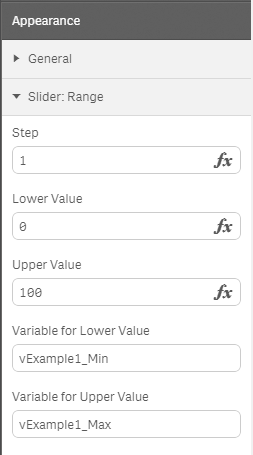

# Range Slider for Qlik Sense

> Slider object for Qlik Sense to manipulate one or two variables.

## Example 

## Properties:

**Step** 
* Amount to change the value by when moving a handle (Default: 1)  

**Lower Value**  
* The minimum value the user can select (Default: 0)  

**Upper Value**  
* The maximum value the user can select (Default: 100)  

**Variable for Lower Value**  
* The variable the lower selected value should be saved to.  

**Variable for Upper Value**  
* The variable the upper selected value should be saved to.  

## Properties Dialog:  
This demonstrates a sample configuration defining:

* A range between 0 and 100
* A step of 1, so the user can change the value in steps by one
* Two variables "taking care" of the values, `vExample1_Min` and `vExample1_Max`

## Creating variables in Qlik Sense:
Create your variables in the Data Load Script, eg.

	SET vMin = 0;
	SET vMax = 100;

Then the variables can be used in the Range Slider.

## Versions:
* [Latest version, Qlik Sense 1.1](https://github.com/stefanwalther/qsRangeSlider/raw/master/build/swr-rangeslider_latest.zip)
* [Version 0.2.0 for Qlik Sense 1.1](https://github.com/stefanwalther/qsRangeSlider/raw/master/build/swr-rangeslider_v0.2.0.zip)
* [Version 0.1.0 for Qlik Sense 1.0](https://github.com/stefanwalther/qsRangeSlider/raw/master/build/RangeSlider_0.1.0.zip)

## Roadmap & Known Issues
This a very, very basic prototype, a lot of features are missing I'd like to implement:

**Issues**
- [ ] **There is an issue with Qlik Sense Server, will be fixed ASAP**
- [ ] The initial value of a variable does not influence the display of the (range) slider

**Features**
- [ ] Decide whether to proceed with [Angular-RangeSlider](https://github.com/danielcrisp/angular-rangeslider) or another solution as a basis
- [ ] Validation
- [ ] Manipulating not only a range of values but also a single value
- [ ] Showing the scale and current value
- [ ] Changing the format/display of the labels
- [ ] Vertical mode
- [ ] Implement a more intelligent delay when the update will be sent to the Qlik Engine

## Contributing
Pull requests and stars are always welcome. For bugs and feature requests, [please create an issue](https://github.com/stefanwalther/qsRangeSlider/issues)

I'd love to see that this becomes a community solution

## Author
**Stefan Walther**
**Stefan Walther** 
* [qliksite.io](http://qliksite.io)
* [github.com/stefanwalther](http://github.com/stefanwalther)
* [twitter.com/waltherstefan](http://twitter.com/waltherstefan)

## License & Copyright
Copyright (c) 2014-2015 Stefan Walther.
Release under the [MIT license](LICENSE.md).

